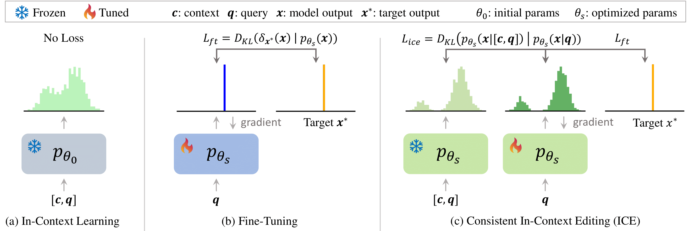

## Hi there 👋

I am an upcoming joint **PhD student** at **the State Key Laboratory of General Artificial Intelligence** <a href='https://www.bigai.ai/'>(BIGAI)</a> and **the University of Science and Technology of China** (USTC), supervised by <a href='https://siyuanqi.github.io/'>Siyuan Qi (BIGAI, 綦思源)</a> and <a href='http://staff.ustc.edu.cn/~binli/'>Bin Li (USTC, 李斌)</a>. Currently, I am doing my internship in State Key Laboratory of General Artificial Intelligence.

I am currently working on knowledge editing about LLMs.

My huggingface at 🤗 [Huggingface home](https://huggingface.co/kailinjiang).

<!-- My research interest includes neural machine translation and computer vision. I have published more than 100 papers at the top international AI conferences with total <a href='https://scholar.google.com/citations?user=DhtAFkwAAAAJ'>google scholar citations <strong>260000+</strong></a> (You can also use google scholar badge ). -->

# 🔥 News
<!-- Allowed emojis: 🎉🎉for good news 📣📣for average news-->
- **2024.06**: &nbsp;🎉🎉 I successfully completed my undergraduate studies from the College of Science of Sichuan Agricultural University!
- **2024.02**: &nbsp;📣📣 I will go to the State Key Laboratory of General Artificial Intelligence <a href='https://www.bigai.ai/'>(BIGAI)</a> to start my internship!

# 📝 Publications 

<table style="border: none;">
  <tr>
    <td style="position: relative; width:20%; vertical-align: top; border: none;">
      
      

        Under Review
      

    </td>
    <td style="width:80%; padding-left: 20px; vertical-align: top; border: none;">
      <a href="https://arxiv.org/pdf/2406.11194">In-Context Editing: Learning Knowledge from Self-Induced Distributions</a> 
      Siyuan Qi, Bangcheng Yang, <strong>Kailin Jiang</strong>, Xiaobo Wang, Jiaqi Li, Yifan Zhong, Yaodong Yang, Zilong Zheng. 【2024.06】
    </td>
  </tr>
</table>

# 🎖 Honors and Awards
- **2022.11** China Telecom Scholarship · Fly Young Award.
  
- **2021.11** National First Prize of Undergraduate Group of National Undergraduate Mathematical Modeling Contest of Gaojiaoshe Cup,team leader. 

# 📖 Educations
- **2024.06 - now**, **University of Science and Technology of China (USTC), PhD student**. I am pursuing a degree in Information and Communication Engineering at USTC's School of Information Science and Technology, and the program is co-training with the State Key Laboratory of General Artificial Intelligence.

- **2020.09 - 2024.06**, **Sichuan Agricultural University (SICAU), graduate student**. I am studying for a degree in Information and Computational Science at the college of science in SICAU.

# 💻 Internships
- **2024.02 - 2024.08**,  the State Key Laboratory of General Artificial Intelligence(Beijing,China), mas lab, algorithm intern.

<!--
**kailinjiang/kailinjiang** is a ✨ _special_ ✨ repository because its `README.md` (this file) appears on your GitHub profile.

Here are some ideas to get you started:

- 🔭 I’m currently working on ...
- 🌱 I’m currently learning ...
- 👯 I’m looking to collaborate on ...
- 🤔 I’m looking for help with ...
- 💬 Ask me about ...
- 📫 How to reach me: ...
- 😄 Pronouns: ...
- ⚡ Fun fact: ...
-->
